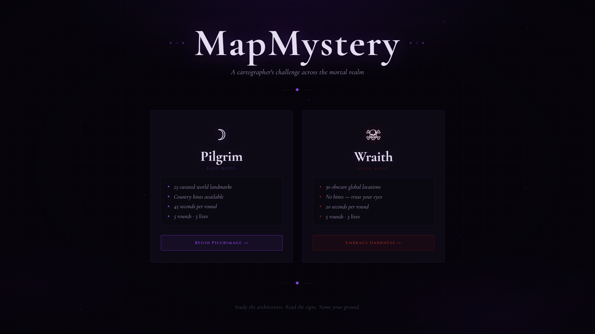
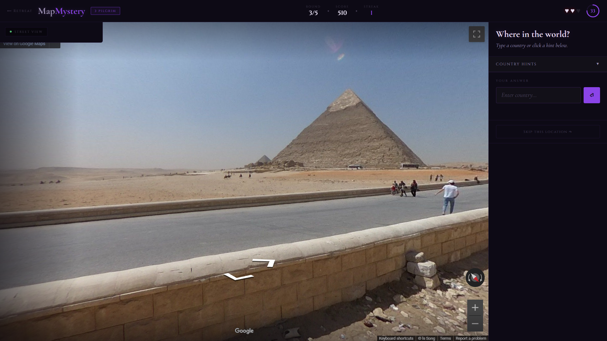

# 🌍 MapMystery — Guess the Location

**MapMystery** is a high-speed, interactive geography game. Players are dropped into random Google Street View locations and must identify the country using visual clues like architecture, language, and terrain—before the clock runs out.

## 🚀 Live Demo

Launch the game here:

## 📸 Preview

### 🏠 Landing Page

 

### 🌍 Gameplay

 

### ✅ Correct Guess Feedback

## ✨ Features

* **Street View Gameplay:** 360° exploration using Google Maps Embed (Street View).
* **Dual Modes:**
    * **Pilgrim:** 45s rounds, famous landmarks, and hints.
    * **Wraith:** 20s rounds, obscure locations, no hints.
* **System:** 3-life heart system, win-streaks, and dynamic scoring.
* **UI/UX:** Responsive design with CSS animations and particle effects.

## 🛠️ Tech Stack

* **Frontend:** HTML5, CSS3, Vanilla JavaScript (ES6+)
* **API:** Google Maps Embed API
* **Deployment:** Vercel

## 📂 Structure

* `index.html`: Landing & Mode selection.
* `game.html`: Core gameplay interface.
* `style.css`: Modern UI & animations.
* `script.js`: Game logic, timers, and API handling.

---
Developed by **Sumedh J Jamadagni**
